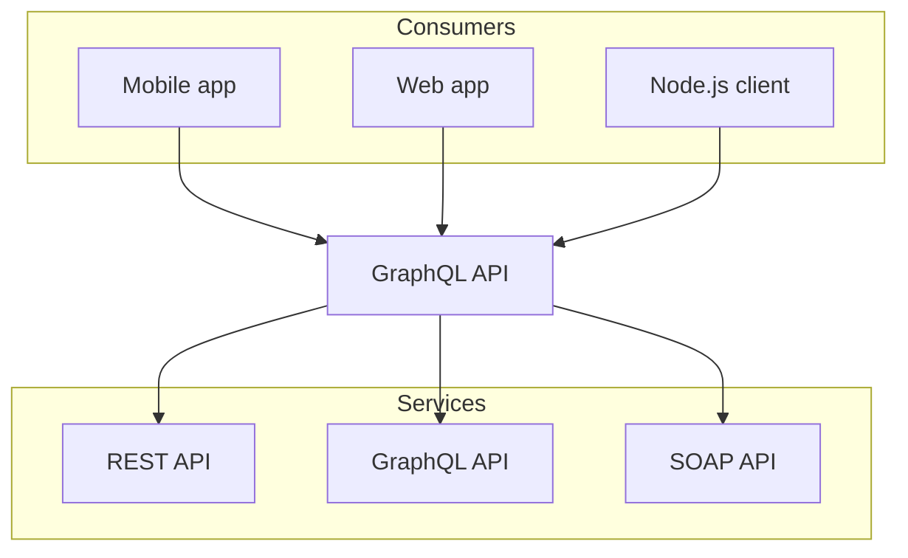

# Notes

- this is home page

## Contents

## Connect

# Important links for Quick Revision

## HTML

- [HTML - 1](https://developer.mozilla.org/en-US/docs/Web/HTML/Reference)

## CSS

- [CSS - 1](https://developer.mozilla.org/en-US/docs/Web/CSS/Reference)

## JavaScript

- [JavaScript - 1](https://developer.mozilla.org/en-US/docs/Web/JavaScript/Reference)
- [JavaScript - 2](https://developer.mozilla.org/en-US/docs/Web/JavaScript/Guide)
- [JavaScript - 3](https://developer.mozilla.org/en-US/docs/Web/API)


## cheatcode

import { Callout, Steps } from "nextra-theme-docs";

# MongoDB

# Week 10 Assignment

| Assessment             | Weight (%)         |
| ---------------------- | ------------------ |
| Assignments            | 10 x 5% each = 50% |
| Project Topic          | 10%                |
| Project Implementation | 40%                |
| **Total**              | **100%**           |

## Prerequisites

[student repositories](/student-work/github-accounts).

Create a `week-10` folder in your Next.js project and copy the contents of your `week-9` folder into it.

## Part 2: Add Cloud Firestore in Firebase

<Steps>

### Firebase console

Navigate to the Firebase console (https://console.firebase.google.com/) and to the project you created in Week 8.

### Add Cloud Firestore service

Under the Product Categories menu on the left, click "Build" and then click on the "Cloud Firestore".

Click on the "Create database" button.

In the pop-up window, use the default settings and click "Next".

Select "Start in production mode" and click "Enable".

### Configure Firestore rules

Click on the "Rules" tab and replace the default rules with the following. These rules will only allow authenticated users (`request.auth != null`) to read and write to their own documents (`request.auth.uid == userId`). These rules are "good enough" for security purposes.

```js copy
rules_version = '2';

service cloud.firestore {
  match /databases/{database}/documents {
    match /users/{userId} {
      allow read, write: if request.auth != null && request.auth.uid == userId;
        match /items/{itemId} {
          allow read, write: if request.auth != null && request.auth.uid == userId;
      }
    }
  }
}
```

Feel free to try the following more restrictive rules. However, you will need to ensure that your data structure matches the rules exactly.


Click on the "Publish" button to publish the new rules.

</Steps>

<Callout type="error" emoji="⚠️">
The data in Cloud Firestore will have the following structure.

- users collection
  - userId document
    - items subcollection
      - itemId document

</Callout>

import MultipleChoice from "components/MultipleChoice";

## 📚 Knowledge Check

<MultipleChoice
  question="Which of the following is NOT suggested as a use case for AI-assisted tools in the course?"
  choices={[
    "AI tools can assist in writing new code, but it is important to understand the code it generates.",
    "AI tools can provide alternative explanations to complex concepts that seem difficult.",
    "AI tools should be solely relied on when learning a new topic.",
    "AI tools can be used to provide additional examples on demand for specific concepts.",
  ]}
  answer="3"
/>

<Callout emoji="⚠️">
  If you ever change your GitHub username, you must let your instructor know.
  This will ensure that your assignments are graded correctly.
</Callout>

### Youtube

<iframe
  style={{ width: "100%", aspectRatio: "16/9" }}
  src="https://www.youtube.com/embed/q3u-Mm55oXg?si=R_3D80W8cfBavWpC"
  title="YouTube video player"
  frameBorder="0"
  allow="accelerometer; autoplay; clipboard-write; encrypted-media; gyroscope; picture-in-picture; web-share"
  allowFullScreen="allowFullScreen"
></iframe>

## Slides


Slide controls: use arrow keys to navigate, press `?` for help, press `f` to toggle fullscreen, `o` for overview mode.

### User Registration and Authentication

A commonplace feature in web applications is the ability for users to register and login. When a user fills out a registration form on the client-side (handled by React.js, Angular.js, Vue.js, etc.), this data is sent to the server-side (Node.js, Python, Ruby, Java, PHP, etc.). The server processes the data, securely stores user information in a database, and then sends a confirmation back to the client-side. When the user attempts to login, the server verifies the entered credentials against the stored data and, if valid, sends a response back to the client-side to grant the user access.


## 🗒️ Summary

<MultipleChoice
  question="1. What is the main difference between a website and a web application?"
  choices={[
    "Websites are interactive, while web applications are static.",
    "Websites and web applications are the same thing.",
    "Websites are primarily informational and display static content, while web applications are interactive and can perform tasks.",
    "Web applications can be accessed through a browser, while websites cannot.",
  ]}
  answer="3"
/>

> While exploring this example, if you encounter aspects that are unclear or confusing, remember there are resources available to help. You can rely on [AI-powered tools](/guides-and-references/course-info#specific-use-cases-for-ai-tools) to answer specific questions or provide further explanations on topics you find challenging. Another valuable resource is your instructor, who has a deep understanding of the topic and can clarify complex concepts, explain the code in a different way, or help troubleshoot any issues you might be facing. Don't hesitate to seek help when needed. Learning is a journey, and asking questions is an essential part of the process.


<Callout type="error" emoji="️🚫">
  Failure to name the project and repository correctly will result in a 0 for
  all assignments.
</Callout>

# Pre-requisite

## Compiler

- [`Online Compiler`](https://www.typescriptlang.org/play/) : TypeScript Playground

> **Good to know**:
>
> - The `.js`, `.jsx`, or `.tsx` file extensions can be used for Pages.
> - A page is always the [leaf](/docs/app/building-your-application/routing#terminology) of the [route subtree](/docs/app/building-your-application/routing#terminology).
> - A `page.js` file is required to make a route segment publicly accessible.
> - Pages are [Server Components](/docs/app/building-your-application/rendering/server-components) by default, but can be set to a [Client Component](/docs/app/building-your-application/rendering/client-components).
> - Pages can fetch data. View the [Data Fetching](/docs/app/building-your-application/data-fetching) section for more information.


- Explore the [Project Showcase](/student-work/showcase) to see what former students have built in this course

<iframe
  style={{ width: "100%", aspectRatio: "16/9" }}
  src="https://www.youtube.com/embed/dv1nON5s2_w?si=aI-Pws_GhdC4nQ8H"
  title="YouTube video player"
  frameBorder="0"
  allow="accelerometer; autoplay; clipboard-write; encrypted-media; gyroscope; picture-in-picture; web-share"
  allowFullScreen="allowFullScreen"
></iframe>

- [View Source Code on GitHub](https://github.com/warsylewicz/webdev2-demos/tree/58f7321e72813955c7773a42128772752b114533/app/week-2)


import { Tabs } from 'nextra/components'
 
<Tabs items={['pnpm', 'npm', 'yarn']}>
  <Tabs.Tab>**pnpm**: Fast, disk space efficient package manager.</Tabs.Tab>
  <Tabs.Tab>**npm** is a package manager for the JavaScript programming language.</Tabs.Tab>
  <Tabs.Tab>**Yarn** is a software packaging system.</Tabs.Tab>
</Tabs>


<Tabs items={['JavaScript', 'TypeScript', 'Java']}>
  <Tabs.Tab label="JavaScript">
    ```js filename="app.js"
    // app/page.js
    export default function Page() {
      return <h1>Hello, javascript page!</h1>;
    }
    ```
  </Tabs.Tab>
  <Tabs.Tab label="TypeScript">
    ```tsx filename="app.tsx"
    // app/page.tsx
    export default function Page() {
      return <h1>Hello, typescript page!</h1>;
    }
    ```
  </Tabs.Tab>
  <Tabs.Tab label="TypeScript">
    ```tsx filename="java.tsx"
    // app/page.tsx
    export default function Page() {
      return <h1>Hello, java page!</h1>;
    }
    ```
  </Tabs.Tab>
</Tabs>


import { FileTree } from 'nextra/components'
 
<FileTree>
  <FileTree.Folder name="pages" defaultOpen>
    <FileTree.File name="_meta.json" />
    <FileTree.File name="contact.md" />
    <FileTree.File name="index.mdx" />
    <FileTree.Folder name="about">
      <FileTree.File name="_meta.json" />
      <FileTree.File name="legal.md" />
      <FileTree.File name="index.mdx" />
    </FileTree.Folder>
  </FileTree.Folder>
</FileTree>





# This is JAVA

import { Card, Cards } from 'nextra/components'

# Guide

The following features are configured via the Next.js configuration and are
available in all themes.

import markdown from "../public/images/icons/markdown.svg"

<Cards>
  <Card
    icon={} 
    title="Files"
    href="/mongodb"
  />
  <Card
    icon={} 
    title="Files"
    href="/mongodb"
  />
  <Card
    icon={} 
    title="Files"
    href="/mongodb"
  />
  <Card
    icon={} 
    title="Files"
    href="/mongodb"
  />
</Cards>

<br />

<figure>
  <figcaption>
    Example: [Nextra Docs Theme](/docs/docs-theme) has sidebar and navbar
    generated automatically from Markdown files.
  </figcaption>
</figure>

<FileTree>
  <FileTree.Folder name="pages" defaultOpen>
    <FileTree.File name="contact.md" />
    <FileTree.File name="index.mdx" />
    <FileTree.Folder name="about" defaultOpen>
      <FileTree.File name="legal.md" />
      <FileTree.File name="index.mdx" />
    </FileTree.Folder>
  </FileTree.Folder>
</FileTree>


```mdx filename="Markdown"
## Hello MDX 

import { useState } from 'react'

export function Counter({ children }) {
  const [count, setCount] = useState(0)
  return (
    <button onClick={() => setCount(count + 1)}>
      {children}
      {count}
    </button>
  )
}

<Counter>**Clicks**: </Counter>
```

```md filename="Markdown"
- [x] Write the press release
- [ ] Update the website
- [ ] Contact the media
```

```md filename="Markdown"
| Syntax        | Description |   Test Text |
| :------------ | :---------: | ----------: |
| Header        |    Title    | Here's this |
| Paragraph     |    Text     |    And more |
| Strikethrough |             |    ~~Text~~ |
```

```js {1,4-6}
import { useState } from 'react'
 
function Counter() {
  const [count, setCount] = useState(0)
  return <button onClick={() => setCount(count + 1)}>{count}</button>
}
```

```js /useState/ /count/1,3-4 copy 
import { useState } from 'react'
 
function Counter() {
  const [count, setCount] = useState(0)
  return <button onClick={() => setCount(count + 1)}>{count}</button>
}
```

```js showLineNumbers
import { useState } from 'react'
 
function Counter() {
  const [count, setCount] = useState(0)
  return <button onClick={() => setCount(count + 1)}>{count}</button>
}
```

```sh npm2yarn
npm i -D @graphql-eslint/eslint-plugin
```
 
<Tabs items={['pnpm', 'npm', 'yarn']}>
  <Tabs.Tab>**pnpm**: Fast, disk space efficient package manager.</Tabs.Tab>
  <Tabs.Tab>**npm** is a package manager for the JavaScript programming language.</Tabs.Tab>
  <Tabs.Tab>**Yarn** is a software packaging system.</Tabs.Tab>
</Tabs>

import { OptionTable } from 'components/table'

Set the repository URL of the documentation. It’s used to generate the
“[Edit this page](#edit-link)” link and the “[Feedback](#feedback-link)” link.

<OptionTable
  options={[
    ['docsRepositoryBase', 'string', 'URL of the documentation repository.']
  ]}
/>

<OptionTable
  options={[
    [
      'primaryHue',
      'number | { dark: number; light: number }',
      'The hue of the primary theme color.'
    ],
    [
      'primarySaturation',
      'number | { dark: number; light: number }',
      'The saturation of the primary theme color.'
    ]
  ]}
/>

Try it out for this website:

| Hue   | Saturation   |
| ----- | ------------ |
| {hue} | {saturation} |

export const hue = (
    <div className="flex h-6 items-center gap-2">
        <input
            type="range"
            min="0"
            max="360"
            step="1"
            onChange={e => {
                const value = `${e.target.value}deg`
                e.target.nextSibling.textContent = value
                document.documentElement.style.setProperty(
                    '--nextra-primary-hue',
                    value
                )
            }}
        />
        <code className="w-14 text-sm text-gray-500" />
    </div>
)

## this is me

export const saturation = (
    <div className="flex h-6 items-center gap-2">
        <input
            type="range"
            min="0"
            max="100"
            step="1"
            onChange={e => {
                const value = `${e.target.value}%`
                e.target.nextSibling.textContent = value
                document.documentElement.style.setProperty(
                    '--nextra-primary-saturation',
                    value
                )
            }}
        />
        <code className="text-sm text-gray-500 w-14" />
    </div>
)
