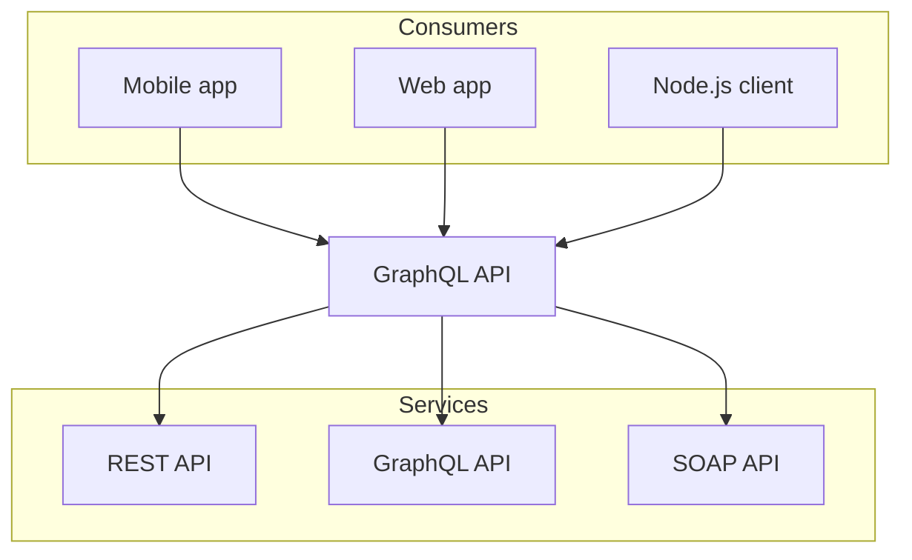

# Week 2: Introduction to React

## Expectations

- Read and do the activities for [Introduction to React](/week-2/react)
- Skim [Guide: Creating a New Next.js Project](/guides-and-references/creating-new-nextjs-project)
- Attend class and participate in the review of this week's content
- Start and complete [Week 2 Assignment](/week-2/assignment)

## Class Recording

### Winter 2024

<iframe
  style={{ width: "100%", aspectRatio: "16/9" }}
  src="https://www.youtube.com/embed/dv1nON5s2_w?si=aI-Pws_GhdC4nQ8H"
  title="YouTube video player"
  frameBorder="0"
  allow="accelerometer; autoplay; clipboard-write; encrypted-media; gyroscope; picture-in-picture; web-share"
  allowFullScreen="allowFullScreen"
></iframe>

- [View Source Code on GitHub](https://github.com/warsylewicz/webdev2-demos/tree/58f7321e72813955c7773a42128772752b114533/app/week-2)

### Slides

import Slideshow from "/components/Slideshow";

<Slideshow file="/week-2/slides" />

```tsx filename="app/page.tsx" switcher
export default async function Page() {
  const data = await fetch('https://api.example.com/...').then((res) =>
    res.json()
  )

  return '...'
}
```
```jsx filename="app/page.js" switcher
export default async function Page() {
  const data = await fetch('https://api.example.com/...').then((res) =>
    res.json()
  )

  return '...'
}
```

import { Tabs } from 'nextra/components'
 
<Tabs items={['pnpm', 'npm', 'yarn']}>
  <Tabs.Tab>**pnpm**: Fast, disk space efficient package manager.</Tabs.Tab>
  <Tabs.Tab>**npm** is a package manager for the JavaScript programming language.</Tabs.Tab>
  <Tabs.Tab>**Yarn** is a software packaging system.</Tabs.Tab>
</Tabs>


<Tabs items={['JavaScript', 'TypeScript', 'Java']}>
  <Tabs.Tab label="JavaScript">
    ```js filename="app.js"
    // app/page.js
    export default function Page() {
      return <h1>Hello, javascript page!</h1>;
    }
    ```
  </Tabs.Tab>
  <Tabs.Tab label="TypeScript">
    ```tsx filename="app.tsx"
    // app/page.tsx
    export default function Page() {
      return <h1>Hello, typescript page!</h1>;
    }
    ```
  </Tabs.Tab>
  <Tabs.Tab label="TypeScript">
    ```tsx filename="java.tsx"
    // app/page.tsx
    export default function Page() {
      return <h1>Hello, java page!</h1>;
    }
    ```
  </Tabs.Tab>
</Tabs>


import { FileTree } from 'nextra/components'
 
<FileTree>
  <FileTree.Folder name="pages" defaultOpen>
    <FileTree.File name="_meta.json" />
    <FileTree.File name="contact.md" />
    <FileTree.File name="index.mdx" />
    <FileTree.Folder name="about">
      <FileTree.File name="_meta.json" />
      <FileTree.File name="legal.md" />
      <FileTree.File name="index.mdx" />
    </FileTree.Folder>
  </FileTree.Folder>
</FileTree>





# Guide

The following features are configured via the Next.js configuration and are
available in all themes.

